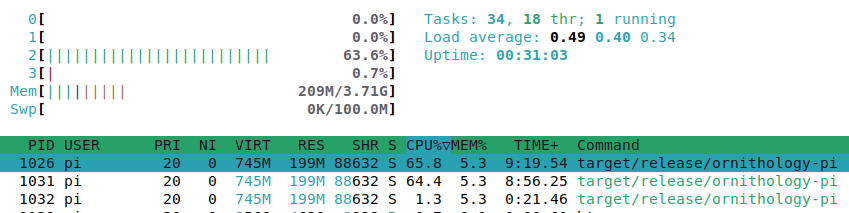

# Documentation for Building and Installing the Project on a Raspberry Pi

This guide will walk you through the process of setting up the Raspberry Pi, building the project, and installing it on the Raspberry Pi.

## Table of Contents

- [Documentation for Building and Installing the Project on a Raspberry Pi](#documentation-for-building-and-installing-the-project-on-a-raspberry-pi)
  - [Table of Contents](#table-of-contents)
  - [Downloading Raspberry Pi OS Lite](#downloading-raspberry-pi-os-lite)
  - [Writing the OS to an SD Card](#writing-the-os-to-an-sd-card)
  - [Configuring WiFi](#configuring-wifi)
  - [Creating a User on Boot](#creating-a-user-on-boot)
    - [Generating Encrypted Password](#generating-encrypted-password)
  - [Enabling SSH on Boot](#enabling-ssh-on-boot)
  - [Finding the Raspberry Pi IP Address](#finding-the-raspberry-pi-ip-address)
    - [Using nmap (Network Mapper)](#using-nmap-network-mapper)
    - [Using the Raspberry Pi](#using-the-raspberry-pi)
  - [Building the Project](#building-the-project)
  - [Installing the Project on Raspberry Pi](#installing-the-project-on-raspberry-pi)
  - [📊 Raspberry Pi 4 Statistics](#-raspberry-pi-4-statistics)
    - [🌡️ Temperature](#️-temperature)
    - [⏱️ Uptime and Load Average](#️-uptime-and-load-average)
    - [📊 System Resource Usage](#-system-resource-usage)
  - [Conclusion](#conclusion)

## Downloading Raspberry Pi OS Lite

1. Go to the [official Raspberry Pi downloads page](https://www.raspberrypi.org/downloads/).
2. Download the latest version of Raspberry Pi OS Lite.

## Writing the OS to an SD Card

1. Insert your SD card into your computer.
2. Download and install a tool for writing images to an SD card, such as [Raspberry Pi Imager](https://www.raspberrypi.org/software/).
3. Open the Raspberry Pi Imager and choose the downloaded Raspberry Pi OS Lite image and your SD card, then click on `Write`.

## Configuring WiFi

1. After writing the Raspberry Pi OS Lite to the SD card, open the `boot` partition in your file explorer.
2. Create a file named `wpa_supplicant.conf` in the `boot` partition.
3. Open the file in a text editor and add the following, replacing `your_network_name` and `your_password` with your WiFi details:

```plaintext
ctrl_interface=DIR=/var/run/wpa_supplicant GROUP=netdev
update_config=1
country=<Insert 2 letter ISO 3166-1 country code here>

network={
 ssid="your_network_name"
 psk="your_password"
}
```

4. Save the file and safely eject the SD card from your computer.

## Creating a User on Boot

To preconfigure an image and set up a user on the first boot without using the Imager, follow these steps:

1. After writing the Raspberry Pi OS Lite to the SD card, open the `boot` partition in your file explorer.
2. Create a file named `userconf` or `userconf.txt` in the `boot` partition. This file should contain a single line of text, in the format:

   ```plaintext
   username:encrypted-password
   ```

   Replace `username` with your desired username and `encrypted-password` with an encrypted representation of the password you want to use.

### Generating Encrypted Password

To generate the encrypted password, you can use OpenSSL on a Raspberry Pi that is already running. Follow these steps:

1. Open a terminal window on the Raspberry Pi.
2. Enter the following command, replacing `'mypassword'` with the password you want to use:

   ```sh
   echo 'mypassword' | openssl passwd -6 -stdin
   ```

   This command will output a string of characters, which is the encrypted version of your password.

3. Copy the encrypted password and paste it into the `userconf` or `userconf.txt` file after the colon (`:`).

Example:

If your desired username is `piuser` and the encrypted password is `$6$xyz$abc...`, the content of the `userconf` or `userconf.txt` file will be:

```plaintext
piuser:$6$xyz$abc...
```

## Enabling SSH on Boot

To enable SSH on your Raspberry Pi on boot, follow the steps below:

1. After writing the Raspberry Pi OS Lite to the SD card, open the `boot` partition in your file explorer.
2. Create an empty file named `ssh` (with no file extension) in the `boot` partition. This will enable SSH on boot.

   On Linux or macOS, you can use the `touch` command to create the file:

   ```sh
   touch /path/to/sd/card/boot/ssh
   ```

   On Windows, you can create a new text document and rename it to `ssh` (ensure that file extensions are visible to remove the `.txt` extension).

3. Safely eject the SD card from your computer and insert it into your Raspberry Pi.
4. Power on the Raspberry Pi. SSH will be enabled, and you can access your Raspberry Pi remotely.

## Finding the Raspberry Pi IP Address

To find the IP address of your Raspberry Pi, you can use one of the following methods:

### Using nmap (Network Mapper)

1. Install nmap on your computer.

   - On Linux:

     ```sh
     sudo apt-get install nmap
     ```

   - On macOS:

     ```sh
     brew install nmap
     ```

   - On Windows, download it from the [official nmap website](https://nmap.org/download.html).

2. Use the following command to scan your network for devices:

   ```sh
   nmap -sn 192.168.x.0/24
   ```

   Replace `192.168.x.0` with your network address. The command will list all devices on your network, along with their IP addresses.

### Using the Raspberry Pi

If you have a monitor and keyboard connected to your Raspberry Pi, you can find the IP address by:

1. Opening a terminal window on the Raspberry Pi.
2. Typing the following command and pressing `Enter`:

   ```sh
   hostname -I
   ```

   The command will return the IP address of your Raspberry Pi.

## Building the Project

1. Insert the SD card into your Raspberry Pi and power it on.
2. SSH into your Raspberry Pi.
3. Install prerequisites:
```sh
sudo apt install git build-essential clang
sudo apt install libgstreamer1.0-dev libgstreamer-plugins-base1.0-dev v4l-utils libssl-dev libdbus-1-dev
curl https://sh.rustup.rs -sSf | sh
cargo install --locked trunk
cargo install --locked wasm-bindgen-cli
```

4. Clone the project repository to your Raspberry Pi:

```sh
git clone https://github.com/chriamue/ornithology-pi
```

5. Navigate to the project directory:

```sh
cd ornithology-pi
```

6. Build the project:

```sh
make build
```

## Installing the Project on Raspberry Pi

1. After building the project, install it:

```sh
make install
```

2. Start the service:

```sh
sudo service ornithology-pi start
```

3. To enable the service on boot:

```sh
sudo systemctl enable ornithology-pi
```

## 📊 Raspberry Pi 4 Statistics

For informational purposes, here are some statistics from running the OrnithologyPi application on a Raspberry Pi 4. These metrics provide insight into the performance and operational state of the Raspberry Pi under the load of the application.

### 🌡️ Temperature

The temperature of the Raspberry Pi while operating the application is maintained at an optimal level. Below is a sample temperature measurement:

```bash
vcgencmd measure_temp
```

**Sample Output:**
```plaintext
temp=56.4'C
```

This output reflects a temperature of 56.4°C, which is within the safe operating range for a Raspberry Pi 4.

### ⏱️ Uptime and Load Average

The uptime and load average offer insight into the system's operational duration and load over time. Below is a sample output for uptime and load average:

```bash
uptime
```

**Sample Output:**
```plaintext
load average: 0.39, 0.39, 0.33
```

This output indicates a system load average of 0.39, 0.39, and 0.33.

### 📊 System Resource Usage

A snapshot of the `htop` output provides a visual representation of the system resource usage, showcasing the processes and their consumption of system resources.

**Command:**
```bash
htop
```

**Sample Screenshot:**

Below is a screenshot of the `htop` output, providing a real-time, interactive view of the processes running on the system.



These statistics offer a glimpse into the performance and efficiency of running the OrnithologyPi application on a Raspberry Pi 4, ensuring its smooth and stable operation.

## Conclusion

You have successfully built and installed the project on your Raspberry Pi. You can now use the application to capture and analyze a video stream to detect and identify birds.

